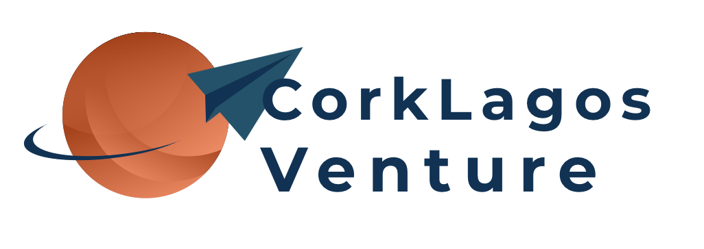
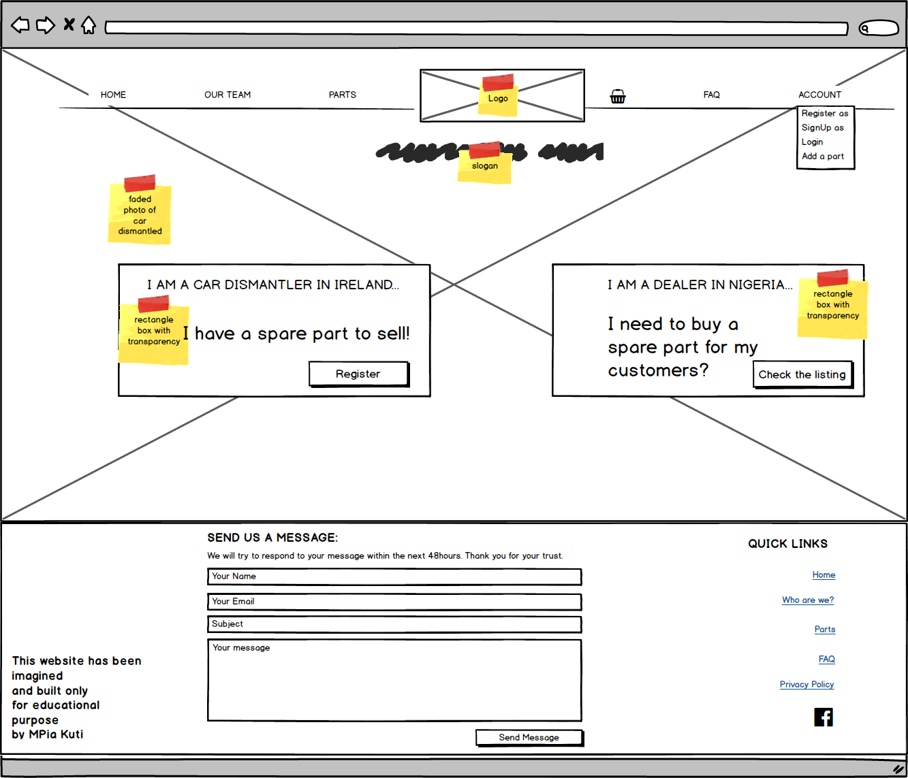
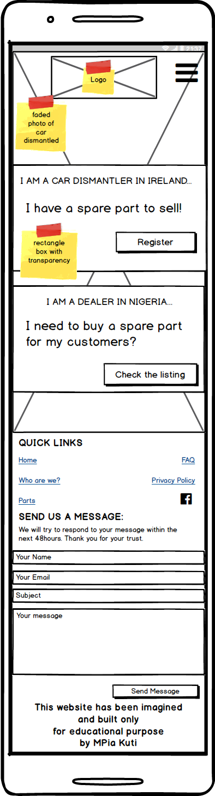
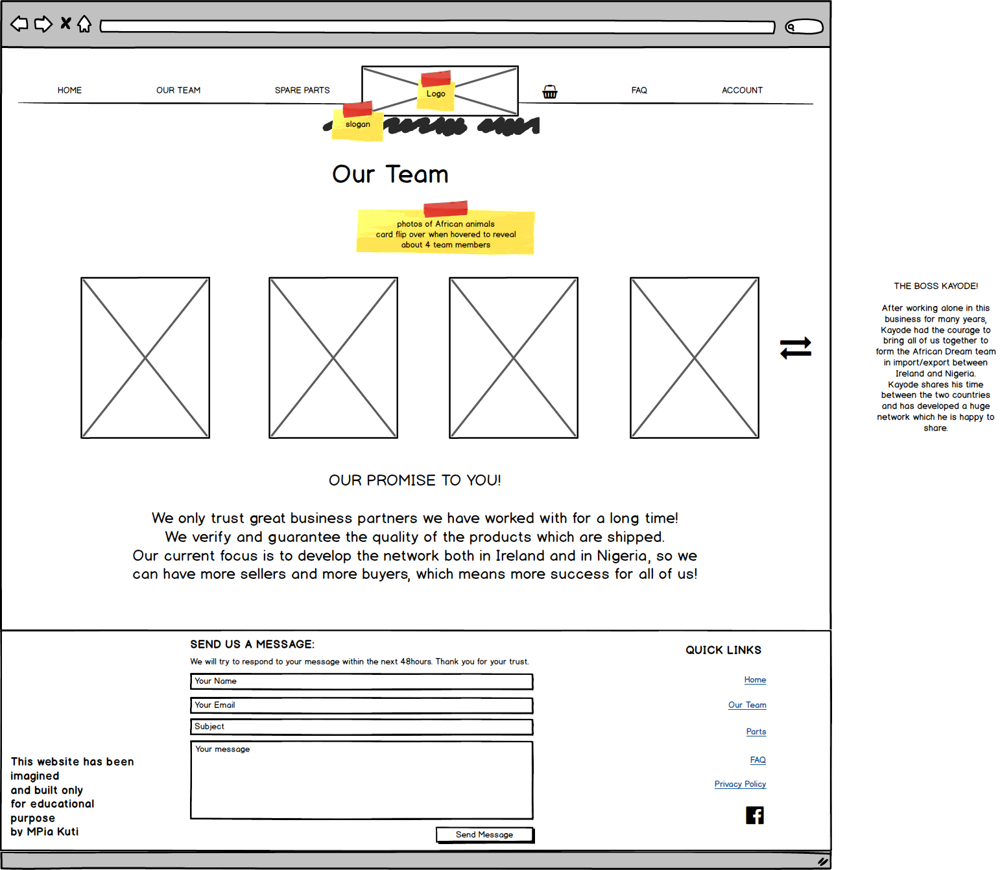
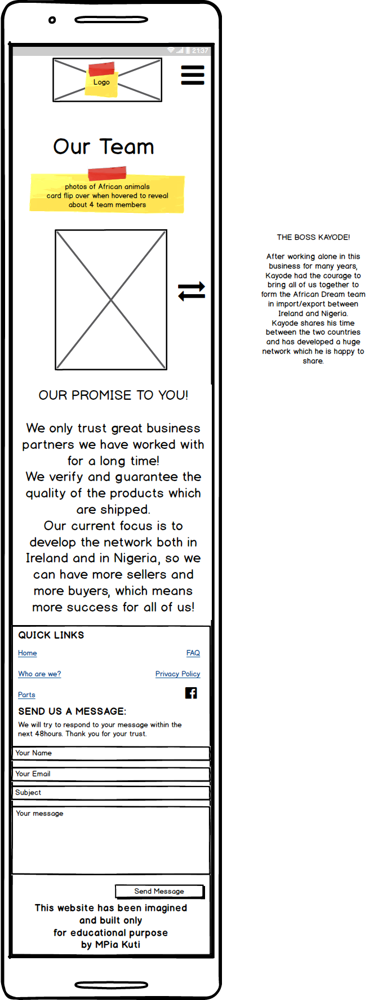
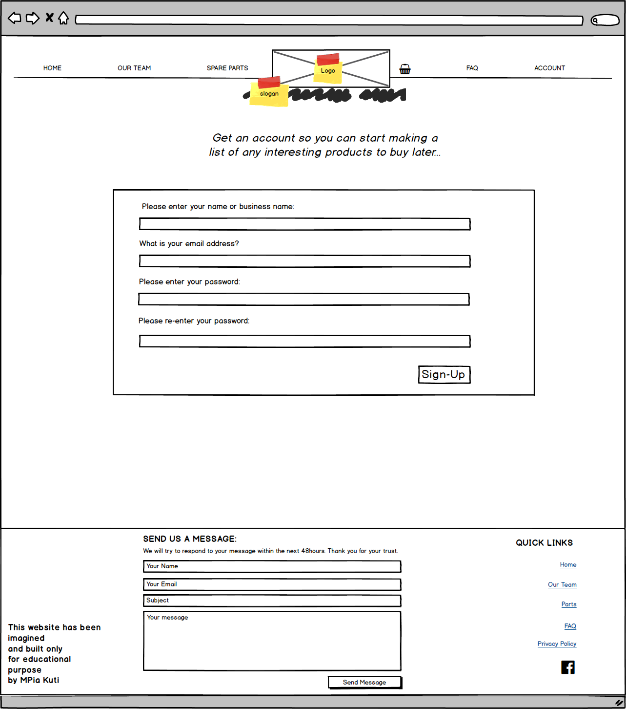
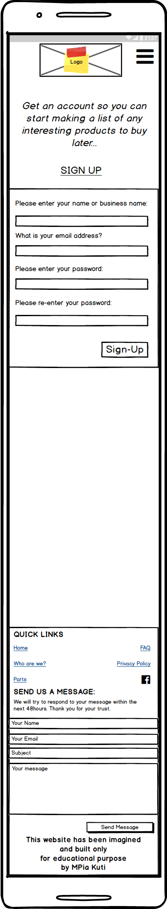
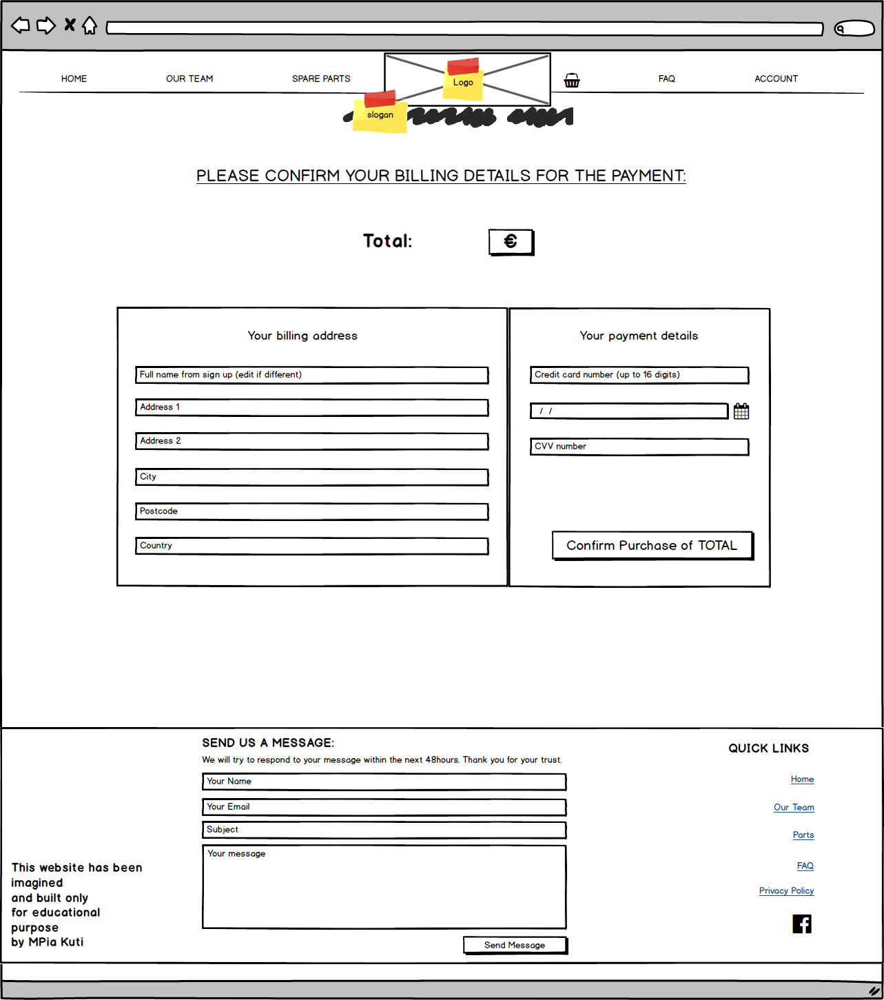
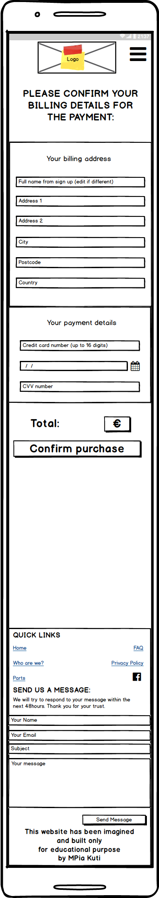
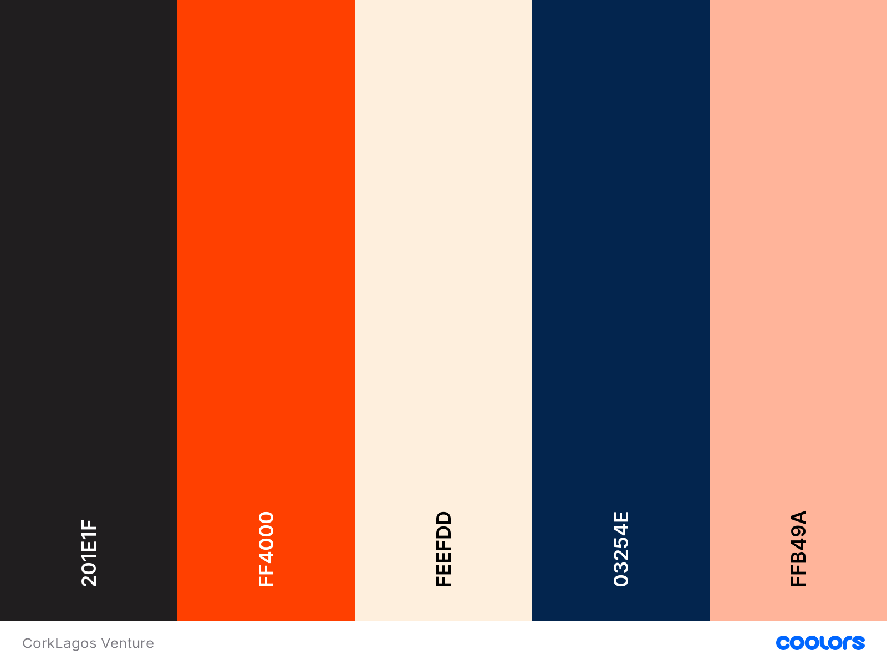

<h1 align="center">
  <a href="" target="_blank"></a>
</h1>

<div align="center">
<a href="" target="_blank"></a>
</div>

CorkLagos Venture was imagined, designed, developed and deployed by MPia Kuti as her final project for the Code Institute Full Stack Web Development diploma.


## Table of Contents

* [Introduction](#introduction)
* [UX](#ux)
    * [Strategy Plane:](#why-and-what)
        * [What are the goals and needs of the user?](#4-what-are-the-goals-and-needs-of-the-user)
        * [What are the goals and needs of the business?](#5-what-are-the-goals-and-needs-of-the-business)
        * [User Stories](#8-user-stories)
    * [Scope plane:](#scope-plane-how)
        * [1.Existing Features](#1-existing-features)
        * [2.Features Left to Implement](#2-features-left-to-implement)
    * [Structure plane: Organisation and functionality](#structure-plane-organisation-and-functionality)
        * [1.Functionality and content](#1-functionality-and-content)
        * [2.Data structure](#2-data-structure)
    * [Skeleton plane: Presentation and navigation](#skeleton-plane-presentation-and-navigation)
        * [1. Wireframes](#1-wireframes)
    * [Surface plane: Design](#surface-design)
        * [1. Color Scheme](#1-color-scheme)
        * [2. Font](#2-font)
        * [3. Logo](#3-logo)
* [Testing](#testing)
* [Technology Used](#technology-used)    
* [Deployment](#deployment)
* [Credits](#credits)
    * [Special Thanks & Acknowledgements](#special-thanks--acknowledgements)

# UX
## Strategy plane

### What are the goals and needs of the user?

* 

### What are the goals and needs of the site owner?

* 


[Back to Top](#table-of-contents) 

### 8. User stories
Based on the audience we have, giving three different user stories visiting the website and displaying unique expectations.

#### 
<em> ""</em>

#### 
<em> ""</em>

#### 
<em> "" </em>

#### Charity X 
<em> "" </em>

1. 

[Back to Top](#table-of-contents) 

## Scope plane: How?

### 1. Existing Features:
* Feature 1 - 
* Feature 2 - 
* Feature 3 - 
* Feature 4 - 
* Feature 5 - 
* Feature 6 - 
* Feature 7 - 
* Feature 8 - 
* Feature 9 - 

### 2. Features Left to Implement:
* 

[Back to Top](#table-of-contents) 

## Structure plane: Organisation and functionality?

### 1. Organisation of functionality and content


[Back to Top](#table-of-contents) 

### 2. Data structure


[Back to Top](#table-of-contents) 
	
## Skeleton plane: Presentation and navigation? 
### 1. Wireframes

I used Balsamiq tool for the wireframes and attached them to the workspace within their own directory at the root level. While I did not spend too much time on the design at that stage,.
For the tablet format, I chose to use the horizontal size (1024x780) as this is how most users would use their tablet size to see websites. 

Please find a few wireframes showing the main page, the Our Team, the signup and payment. All the other wireframes can be found [here](https://github.com/mkuti/corklagos-venture/tree/master/wireframes)

<div align="center">
    
</div>

<div align="center">
    
</div>

<div align="center">
    
</div>

<div align="center">
    
</div>

<div align="center">
    
</div>

<div align="center">
    
</div>

<div align="center">
    
</div>

<div align="center">
    
</div>

[Back to Top](#table-of-contents) 

## Surface plane: Design 

Since design and UX are not my biggest qualities, I often spend time deciding on the right elements which will ensure the website being a success for the site owners and the users.
I inspired myself from general ecommerce websites and did not want to innovate too much here because we want to attract traditional website users who do not have huge time to spend searching for the exact information. 
I looked around at different templates and liked the animations suggested on [BootStrapMade Company template](https://bootstrapmade.com/demo/Company/), which I will apply to the display of car parts listing.
For the team page, I wanted to innovate a little since the few users consulting this page will probably have time to stop and read. With very little content, the idea is to grab the attention of the user and get them to want to read more.

##### Colours:
With a primary audience of men and the website main goal in attracting more users, the keywords which helped me to find the colors were reliability, power, excitement, engagement. The colors chosen will complement each other in achieving this, as well as making the website somehow reflecting the origins of the site owners and reviving their pride.

<div align="center">
    
</div>

- Eerie Black: #201e1f;
- Red-Orange (Color Wheel): #ff4000;
- Antique White: #feefdd;
- Oxford Blue: #03254e;
- Melon: #ffb49a;

* Primary:  <strong>Oxford Blue</strong> I chose this as the primary colour as blue's psychological perception is associated with competence, reliability and high quality which is the main message we want to communicate here for our clients and users. The website need to trigger a feeling that the business owners are reliable partners whom they can trust to sell or buy. The color works also perfectly in association with the secondary color, reminding the users the African colors.
* Secondary:  <strong>Red-Orange (Color Wheel)</strong>I chose this as the secondary colour as red and orange conveys a sense of speed and excitement which can be associated with anything related to car. Also its bright color associated with blue is reminding that the trade is done with Nigeria where the site owners are from. The two colors remind the sun, the spectacular landscapes, the beautiful colors used in native clothes proudly wore by the Nigerians.
* Tertiary:  <strong>Melon</strong> This tertiary colour will compliment the main orange color and will be used for small parts, such as icons or the text color of box or buttons highlighted by the primary color. This color is also a reminder of the sand hugely present in Africa.

##### Logo:
I used [Hatchful Shopify](https://hatchful.shopify.com/) to find the most suitable logo. With the keywords of the website in my head, I first selected the bold, reliable and energetic visual styles for the logo. I instantly picked one suggestion of logo with the earth and enveloppe going around. See [the original logo](https://raw.githubusercontent.com/mkuti/corklagos-venture/master/static/images/originallogo.png). It looked smart and bold. I changed slightly the style to have the business name outside the icon which gave a more professional look. I also straight away chose to have the contrast between blue and orange, which made me think of the bold colors of Africa.

##### Fonts: 


##### Icons:
Without flooding too much the website with icons everywhere, I am only mainly using the icons for the categories and brands associated with the product listings so the user can quickly identify the category even if the word itself does not give a meaning.

##### Background:


# Technologies Used: 

### Languages:

- __HTML__ language is used to create the structure of the website and game.
- __CSS__ language is used to add styling on the structure of the website.
- __Javascript__ functioning language is used to fetch external data and add interactivity on the website so the game functions based on user's actions
- __Python__ Object-oriented programming and structured programming language which allows smooth communication between the backend and frontend. 

### Tools & Libraries:
- [GitPod](gitpod.io) - I used __GitPod__ as my IDE for the development of this website.
- [jQuery](https://jquery.com/) and [Popper.js](https://popper.js.org/) - The website uses __jQuery__ and __Popper.js__ to bring in Javascript which makes the navbar responsive
-  [Git](https://git-scm.com/)
- [BootstrapCDN](https://www.bootstrapcdn.com/) - The website is using __Bootstrap4__ as the basic structure and grid of the website and to increase the responsiveness of the website.
- [jQuery](https://jquery.com/) - I used jQuery to avoid repeating same actions on the DOM when buttons were clicked
- [Flask](https://flask.palletsprojects.com/en/1.1.x/) - I used Flask framework, Jinja templates and Werkzeug to 
Python werkzeug.check_password_hash()
- [FontAwesome](https://kit.fontawesome.com/f7e192f540.js) - The website is using __Font Awesome__ to display the social media icons in my footer
- [Google Fonts](https://fonts.google.com/)- The website uses __Google font__- Url imported in CSS
- [AutoPrefixer](https://autoprefixer.github.io/) - I have used __AutoPrefixer__ to make sure the css code worked on all browsers
- [Tiny.jpg](https://tinyjpg.com) - I have used __Tinyjpg__ to compress logo image of the website to increase the website loading on browser
- [Coolors](https://coolors.co/) - I have used __ColorSpace__ to find matching colors for the website
- [Balsamiq](https://balsamiq.cloud) - I have used __Balsamic__ to build the wireframes which I then exported to the IDE
- [Favicon converter](https://favicon.io/favicon-converter/) - I used Favicon converter to convert the logo into a favicon which I was able to insert in the asset folder and I tested it to be working
- [Sweetalert2](https://sweetalert2.github.io/)
- [Unicorn Revealer](https://chrome.google.com/webstore/detail/unicorn-revealer/lmlkphhdlngaicolpmaakfmhplagoaln?hl=en-GB) Chrome extension to show content structure, margin and paddings and fix any offset
- [Lunapic](https://www2.lunapic.com/editor/) - to make the logo transparent
- [Spinkit](https://tobiasahlin.com/spinkit/) - for the loader css and html
- [Techsini Multi-Mockup](https://techsini.com/multi-mockup/index.php) - to create multi-device photo of README
- [Tables Generator](https://www.tablesgenerator.com/markdown_tables#) for generating Markdown tables for README

[Back to Top](#table-of-contents) 

# Testing

I created a separate document for Testing writeup which can be found [here](https://github.com/mkuti/..../blob/master/test.md)

[Back to Top](#table-of-contents) 

# Media and Content origin
1. 
2. 

[Back to Top](#table-of-contents) 

# Deployment
I have been using the Integrated development environment (IDE) [GitPod](gitpod.io) to develop this milestone project.
As I used it for the first time and Code Institute changed the preferred IDE for the whole course, I was lucky to avail of the full template prepared by Code Institute at the time.

I went to Code Institute [full template repository](https://github.com/Code-Institute-Org/gitpod-full-template), cloned it and created my own repository with the template ready. From there, I opened GitPod which started a workspace.

From that point, I could add, commit any update of my code and push it to the remote repository so it could be regularly backed up and accessed by others.

### GitHub
All versions and branches of the code are stored in github:


## How to run this project locally

To run this project on your own IDE follow the instructions below:

Ensure you have the following tools: 
- An IDE such as [GitPod](https://gitpod.io/)

The following **must be installed** on your machine:
- [PIP](https://pip.pypa.io/en/stable/installing/)
- [Python 3](https://www.python.org/downloads/)
- [Git](https://gist.github.com/derhuerst/1b15ff4652a867391f03)
- If you use Code Institute template, all the above will be already installed
- [Django](https://docs.djangoproject.com/en/3.0/releases/3.0/)
- 
- 
...

### Instructions
1. Install all required modules with the command 
```pip3 install -r requirements.txt```

2. In your local IDE create a file called `env.py`

3. Inside the env.py file, create a SECRET_KEY variable 

4. Make sure to add env.py to a .gitignore file so it's not pushed to the repository

4. You can now run the application with the command
```python3 manage.py runserver```

9. You can visit the website at ``

## Heroku Deployment

To deploy the app to heroku, you would need to follow the following steps:

1. Create a `requirements.txt` file using the terminal command `pip freeze > requirements.txt`.

2. Create a `Procfile` with the terminal command `echo web: python app.py > Procfile`.

3. `git add` and `git commit` the new requirements and Procfile and then `git push` the project to GitHub.

3. Create a new app on the [Heroku website](https://dashboard.heroku.com/apps) by clicking the "New" button in your dashboard. Give it a name and set the region to Europe.

4. From the heroku dashboard of your newly created application, click on "Deploy" > "Deployment method" and select GitHub.

5. Confirm the linking of the heroku app to the correct GitHub repository.

6. In the heroku dashboard for the application, click on "Settings" > "Reveal Config Vars".

7. Set the following config vars:

| Key | Value |
 --- | ---
SECRET_KEY | `<your_secret_key>`

8. In the heroku dashboard, click "Deploy".

9. In the "Manual Deployment" section of this page, made sure the master branch is selected and then click "Deploy Branch".

10. The site is now successfully deployed.

[Back to Top](#table-of-contents) 

# Credits
* 

# Special thanks

To my mentor, [Simen Dehlin](https://github.com/Eventyret), 


To all in the #peer-code-review channel of Slack who were kind enough to provide their feedback and find bugs or provide solution.

To my two sons Léon and Seyi whose time with me is being sacrificed currently, for being patient with me when I am tired after sleepless nights.

##### Disclaimer:
The content of the website is for educational purposes only.

[Back to Top](#table-of-contents) 